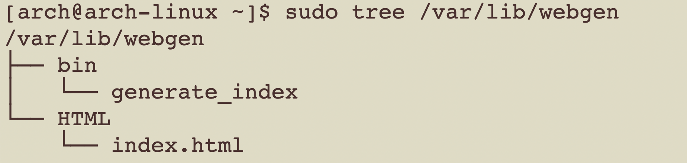
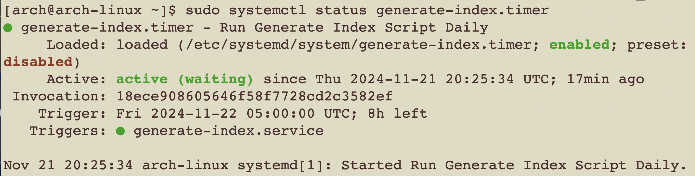
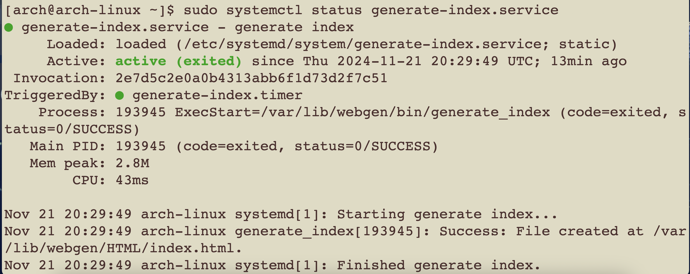
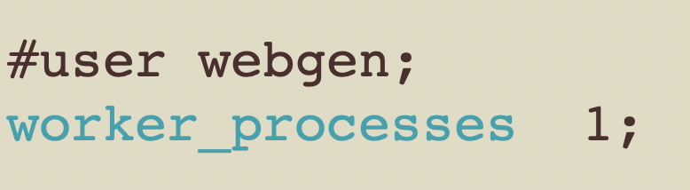
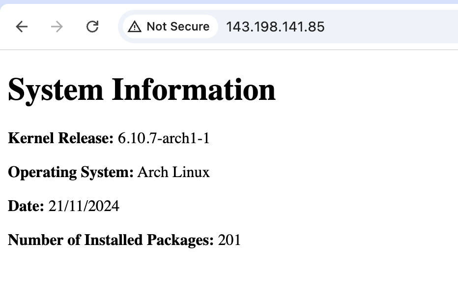

# Part 1
## Task 1 
1. Create a system user webgen with a home directory at /var/lib/webgen and a login shell appropriate for a non-login user:
```
sudo useradd --system -d /var/lib/webgen -s /usr/bin/nologin webgen
```
2. Create required directory:
```
sudo mkdir -p /var/lib/webgen/bin
```
```
sudo mkdir -p /var/lib/webgen/HTML
```
3. Create required files:
```
sudo touch /var/lib/webgen/bin/generate_index
```
```
sudo touch /var/lib/webgen/HTML/index.html
```
4. Set Ownership for the User:
```
sudo chown -R webgen:webgen /var/lib/webgen
```
5. Verify 

https://wiki.archlinux.org/title/Users_and_groups 5.2 Example adding a system user

## Task 2
1. Create the generate-index.service:
```
sudo nvim /etc/systemd/system/generate-index.service
```
2. 
```
sudo nvim /etc/systemd/system/generate-index.timer
```
2. To check whether its running
```
sudo systemctl status generate-index.timer
```
```
sudo systemctl status generate-index.service
```

```
sudo systemctl daemon-reload
```
Verify:


https://wiki.archlinux.org/title/Systemd

## Task 3
1. Modify nginx.conf to run as webgen
```
sudo nvim /etc/nginx/nginx.conf
```

3. Create a Separate Server Block File
- Create directory
```
sudo mkdir -p /etc/nginx/sites-available 
sudo mkdir -p /etc/nginx/sites-enabled
```
https://wiki.archlinux.org/title/Nginx 3.2.3.1 Managing server entries

- Create a new server block file:
```
sudo nvim /etc/nginx/sites-available/webgen
```
- Create a symlink to enable the site:
```
sudo ln -s /etc/nginx/sites-available/webgen /etc/nginx/sites-enabled/
```
- Why is it important to use a separate server block file instead of modifying the main nginx.conf file directly?  
 - A server block allows you to setup multiple web servers on a single server 
- Check the status of the nginx services 
```
sudo systemctl status nginx
```
- Test syntax error 
```
sudo nginx -t
```
Visit in browser:
```
http://143.198.141.85
```

## Task 4
1. Install ufw
```
sudo pacman -S ufw
```
2. 
```
sudo ufw allow ssh
```
```
sudo ufw limit ssh
```
```
sudo ufw allow http
```
```
sudo ufw enable
```
```
sudo ufw status verbose
            