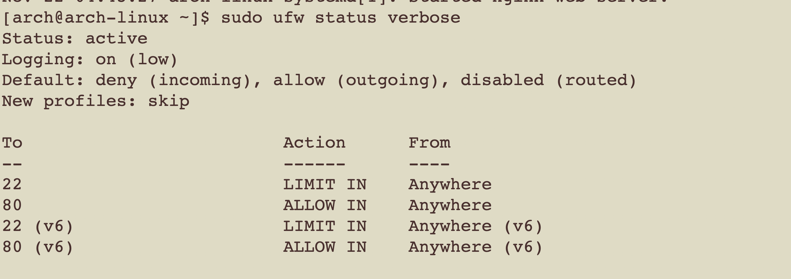
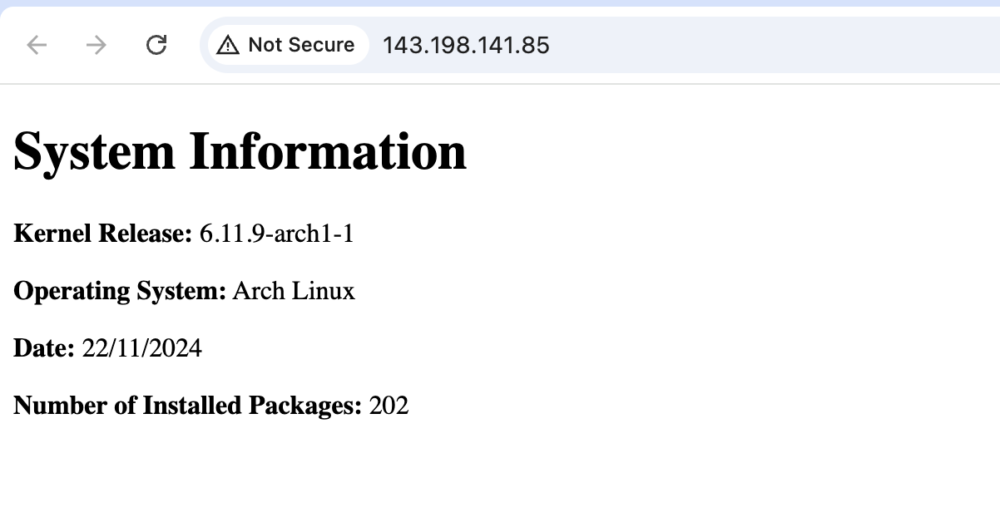

# Part 1
## Task 1 
1. Create a system user webgen with a home directory at /var/lib/webgen and a login shell appropriate for a non-login user:
```
sudo useradd --system -d /var/lib/webgen -s /usr/bin/nologin webgen
```
- Creating a system user for this task to enhance security. It ensures that only the webgen user has access to files and directories(chown), hardening the system. 

2. Create required directory:
```
sudo mkdir -p /var/lib/webgen/bin
```
```
sudo mkdir -p /var/lib/webgen/HTML
```
3. Create required files:
```
sudo touch /var/lib/webgen/bin/generate_index
```
```
sudo touch /var/lib/webgen/HTML/index.html
```
4. Set Ownership for the User:
```
sudo chown -R webgen:webgen /var/lib/webgen
```
5. Verify 


Ref: https://wiki.archlinux.org/title/Users_and_groups 5.2 Example adding a system user

## Task 2
1. Create the generate-index.service:
```
sudo nvim /etc/systemd/system/generate-index.service
```
2. Create the generate-index.timer:
```
sudo nvim /etc/systemd/system/generate-index.timer
```
3. Reload after configurations: 
```
sudo systemctl daemon-reload
```
4. Enable and start the timer:
```
sudo systemctl enable --now generate-index.timer
```
5. To check whether its running
```
sudo systemctl status generate-index.timer
```
```
sudo systemctl status generate-index.service
```
6. Check logs:
```
journalctl -u generate-index.service
```
https://wiki.archlinux.org/title/Systemd


7. Verify


## Task 3
1. Modify nginx.conf to run as webgen
```
sudo nvim /etc/nginx/nginx.conf
```

2. Create a Separate Server Block File
- Create directory
```
sudo mkdir -p /etc/nginx/sites-available 
sudo mkdir -p /etc/nginx/sites-enabled
```
- Create a new server block file:
```
sudo nvim /etc/nginx/sites-available/webgen
```
- Create a symlink to enable the site:
```
sudo ln -s /etc/nginx/sites-available/webgen /etc/nginx/sites-enabled/
```
https://wiki.archlinux.org/title/Nginx 3.2.3.1 Managing server entries

 - A server block allows you to setup multiple web servers on a single server. It also allows you to easily enable or disable certain sites. 
 
Ref: Week 12 lecture notes
 
Ref: https://wiki.archlinux.org/title/Nginx

3. Test syntax error 
```
sudo nginx -t
```
4. Check the status of the nginx services 
```
sudo systemctl status nginx
```


## Task 4
1. Install ufw:
```
sudo pacman -S ufw
```
2. Setting up firewall:
```
sudo ufw allow ssh
```
```
sudo ufw limit ssh
```
```
sudo ufw allow http
```
3. After setting up, enable:
```
sudo ufw enable
```
4. Check status: 
```
sudo ufw status verbose
```
5. Verify

6. Note: In this task, when I want to set up rules for firewall, I keep receiving errors "[Errno 2] iptables v1.8.10 (legacy): can't initialize iptables table `filter': Table does not exist (do you need to insmod?)". After I consult with my classmates Jovica, I resolved it by rebooting the system. 

Ref: Week 12 lecture note

## Task 5
1. Vist Browser with droplet ip address:

http://143.198.141.85

2. Screenshots:

